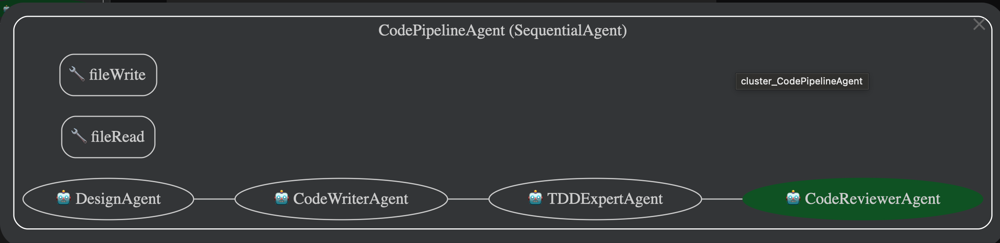

# AGI Agent - ADK-GO AI Agent

## Official ADK Go Repository

https://github.com/google/adk-go

## Getting Started

### Prerequisites

This application is configured to use **local Ollama** as the LLM provider by default.

1. **Install Ollama**: Download from [ollama.ai](https://ollama.ai)
2. **Pull a model**:
   ```bash
   ollama pull gpt-oss:20b
   ```

### Quick Start

Run application

```bash
make run
```

The application will use `gpt-oss:20b` by default. To use a different model:


### Available Commands

- `make build` - Build the AGI agent binary
- `make run` - Build and run the AGI agent with local Ollama
- `make test` - Run unit tests
- `make e2e` - Run end-to-end tests
- `make lint` - Run code linters
- `make ollama-setup` - Display Ollama setup instructions
- `make ollama-check` - Verify Ollama is running and configured

### Environment Variables

- `OLLAMA_BASE_URL` - Ollama API endpoint (default: `http://localhost:11434`)
- `OLLAMA_MODEL` - Model to use (default: `gpt-oss:20b`)

### Technology Stack

The application uses the official [Ollama Go API client](https://github.com/ollama/ollama) for native integration with Ollama models.

### Recommended Models

- **gpt-oss:20b** - default model

### Agent Pipeline Overview

The agent pipeline consists of four sequential sub-agents that work together to generate, test, and review code:



1. **DesignAgent** - Creates high-level architecture and design
2. **CodeWriterAgent** - Implements code based on the design
3. **TDDExpertAgent** - Writes comprehensive tests for the code
4. **CodeReviewerAgent** - Reviews code and provides feedback

